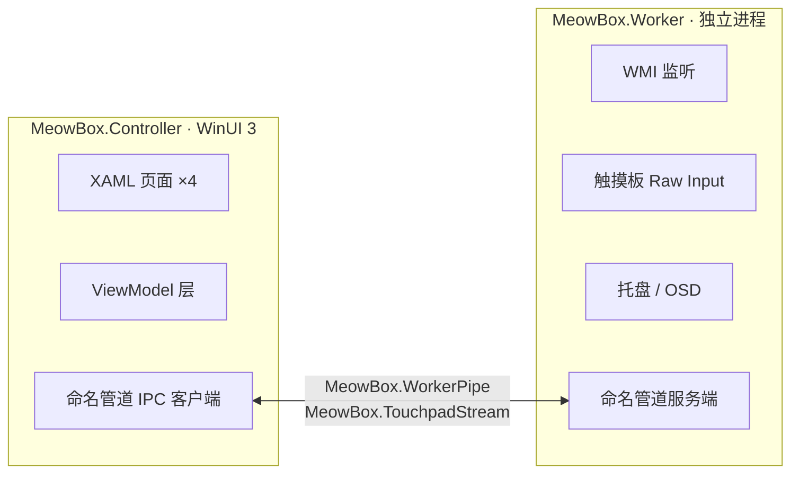
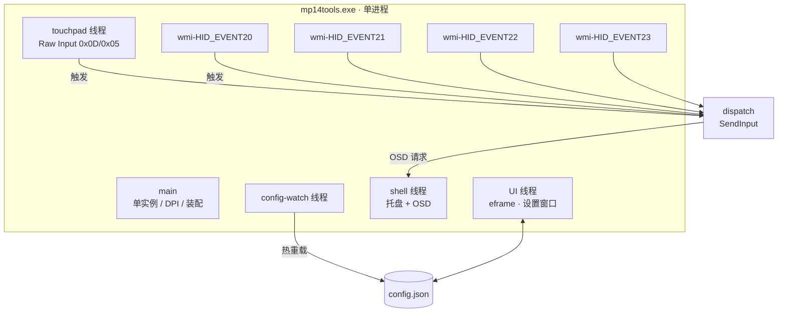
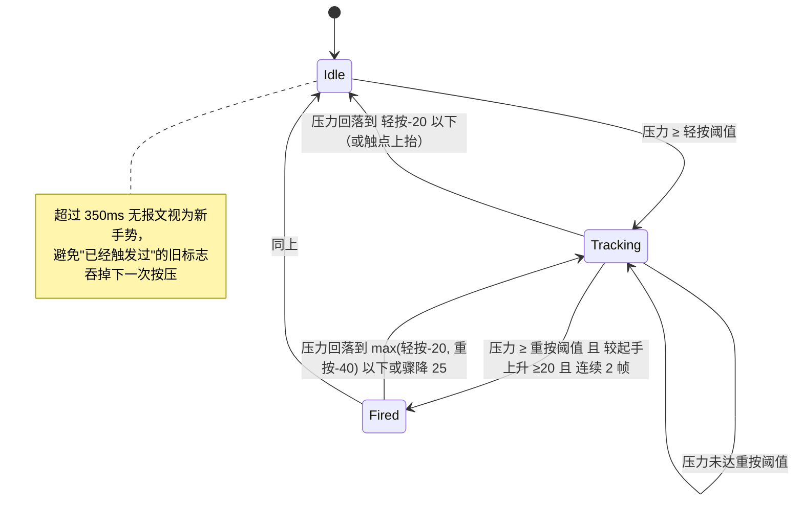

# MP14Tools 重构报告

> 本文档已随仓库整理移入 `docs\`；文中相对路径均以**项目根目录**为基准
> （目录已由 `mp14tools\` 改名为 `mp14tools-main\`）。

> 本报告对应 `mp14tools/` 目录（位于工作区根目录 `g:\Work\Code\MP14Tools\`，原 `Meow-Box-main\meowbox_lite`），
> 是对 `src/MeowBox.*`（WinUI 3 双进程版本）的精简重构。
> 报告包含需求对照、架构对比、实现说明、**实测数据**，以及本次执行中遇到的环境阻塞记录
> （这部分对后续维护者同样重要，所以保留了细节）。

---

## 1. 结论摘要

| 目标 | 结果 |
|---|---|
| 触摸板重按 → 可选按键/鼠标/组合键 | ✅ 已实现并验证（Raw HID 注册成功） |
| OEM 按键 → 可选按键/鼠标/组合键 | ✅ 已实现并验证（`HID_EVENT20…23` 全部订阅成功） |
| 进程/占用精简 | ✅ 单进程，无服务、无安装包、无子进程 |
| 现代 Win11 界面 | ✅ egui + Segoe UI/YaHei + DWM 圆角/深色标题栏 |
| 单独目录 + 报告 | ✅ `mp14tools/`，本文件 |

---

## 2. 交付物

```
mp14tools/
├─ Cargo.toml                 依赖与 release 优化配置
├─ Cargo.lock                 锁定版本
├─ build.ps1                  构建入口（自动装配工具链 PATH）
├─ README.md                  使用与构建说明
├─ REPORT.md                  本报告
├─ BUILD-REPORT.md            本次目录整理（迁移）报告
├─ MANUAL-CLEANUP.md          需你手动清理的项清单
├─ .gitignore
├─ .cargo/config.toml         把 cargo 输出重定向到 build\obj
├─ tools/
│  ├─ install-mingw.ps1       安装构建所需的 dlltool/as 工具对
│  ├─ diagnose.ps1            环境诊断（工具链、应用控制策略）
│  └─ measure.ps1             占用/功耗相关指标测量
├─ build/                     全部生成物（已在 .gitignore 中，可整个删除）
│  ├─ obj/                    cargo target：编译中间文件与 exe
│  ├─ toolchain/              assembler / mingw64 / downloads
│  └─ temp/                   构建期间的临时与诊断文件
└─ src/
   ├─ main.rs                 入口：单实例、DPI、线程装配、配置监视
   ├─ config.rs               配置模型、默认值、读写
   ├─ catalog.rs              目标按键目录（键盘 + 鼠标）
   ├─ input.rs                `SendInput` 发送组合键
   ├─ touchpad.rs             Raw HID 触摸板监听与重按判定
   ├─ oemkeys.rs              WMI 事件订阅与 OEM 键匹配
   ├─ state.rs                线程间共享状态与触发分发
   ├─ tray.rs                 托盘图标、右键菜单、运行时生成图标
   ├─ osd.rs                  圆角、点击穿透的 OSD 提示窗
   ├─ autostart.rs            开机自启（HKCU Run）
   ├─ ui.rs                   设置窗口（egui，Win11 风格）
   ├─ win.rs                  宽字符串/模块句柄等小工具
   └─ log.rs                  轻量文件日志
```

代码规模：2903 行 Rust（含注释），13 个模块，编译零警告。

---

## 3. 需求对照

| 需求 | 实现方式 |
|---|---|
| 触摸板重按映射为可选按键 | `touchpad.rs` 解析 HID 报文得到压力值；达到重按阈值并连续 2 帧确认后触发；目标可以是任意键盘键、鼠标键或带修饰键的组合 |
| OEM 按键映射为可选按键 | `oemkeys.rs` 订阅 `ROOT\WMI` 的 `HID_EVENT20…23`，用报告前缀匹配按键，命中后发送同样的目标动作 |
| 鼠标/键盘/任意组合键 | `input.rs` 统一用 `SendInput`：修饰键（Ctrl/Shift/Alt/Win）+ 目标（键盘虚拟键 或 鼠标左/右/中/侧键 1、2） |
| 开销更小 | 单进程、无安装包、无服务；空闲时不轮询硬件、不刷新 UI，详见第 6 节实测 |
| 现代 Win11 UI | egui 定制视觉：8/6px 圆角、Win11 强调色、Segoe UI + 微软雅黑、跟随系统深浅色、DWM 圆角与深色标题栏 |
| 单独新建目录 | `mp14tools/`，与原有 `src/MeowBox.*` 完全隔离，未修改任何原工程文件 |
| 报告 | 本文件 |

---

## 4. 架构对比

### 原实现



两个进程、四个页面、完整 MVVM、两个命名管道、资源本地化（`x:uid` + `resw` 双语）、
动作类型二十余种。功能完整，但常驻成本高、构建链重（WinUI 3 + `build.ps1` 打包脚本）。

### 新实现



去掉的东西：第二个进程、IPC、MVVM 分层、资源本地化框架、二十余种动作类型、
边缘滑动/五指捏合/角落长按。保留并强化的东西：**重按检测**与**OEM 键重映射**。

> 0.2.1 补回了“私有 HID 写入”一项，但只限**震动力度**，且默认关闭：它不影响重按检测与热键映射，
> 不启用时全工具仍与 0.1.0 一样只读。详见 `README.md` 的功能表与已知限制。

---

## 5. 实现说明

### 5.1 线程模型

| 线程 | 职责 | 空闲时的状态 |
|---|---|---|
| main / UI | eframe 事件循环与设置窗口 | 阻塞在消息循环 |
| shell | 托盘图标、右键菜单、OSD 窗口 | 阻塞在 `GetMessageW` |
| touchpad | Raw Input 窗口与报文处理 | 阻塞在 `GetMessageW` |
| wmi-HID_EVENT20…23 | 每类一个订阅 | 阻塞在 `IEnumWbemClassObject::Next` |
| config-watch | 每 1.5s 比对配置文件内容 | 睡眠 |

设计要点：

- **没有任何轮询硬件的循环**。触摸板由系统在 `WM_INPUT` 里推送；OEM 键由 WMI 在
  `Next` 上阻塞推送；两者空闲时都不消耗 CPU。
- 唯一的周期性活动是配置监视（每 1.5 秒读一次 3KB 的缓存文件），用于热重载。
- 设置窗口关闭后 UI 线程仍存活（窗口只是隐藏），不会反复创建/销毁 GL 上下文。
  只有 Touchpad 页可见时才以 150ms 间隔重绘压力读数。

### 5.2 触摸板重按检测（`touchpad.rs`）

数据路径：

1. 隐藏窗口注册 Raw Input：`UsagePage 0x0D`（Digitizer）/ `Usage 0x05`（Touch Pad），
   标志 `RIDEV_INPUTSINK | RIDEV_DEVNOTIFY`。`INPUTSINK` 保证窗口不在前台也能收到报文。
2. `WM_INPUT` → `GetRawInputData` 取缓冲区。**不把字节缓冲区强转成 `RAWINPUT` 结构体**，
   而是按小端偏移读取（`dwType`、`dwSizeHid`、`dwCount`），避免对齐假设。
3. 逐帧解码：`report[0]` 必须是 `0x04`；之后每 7 字节一个触点
   （`flags` / `X` / `Y` / `Pressure`，坐标与压力均为 16 位）；尾部读扫描时间、
   触点数与物理按键位。压力取所有有效触点的最大值。

状态机（`PressState::observe`）逐帧推进。判定完全由压力驱动，两个阈值都来自设置界面，
改动即时生效：



要点：

- **轻按阈值是“这是一次按压”的门槛**：低于它什么都不跟踪，调高就必须按得更重，调低则轻微触压也能进入跟踪。
- **两帧确认 + 起手上升量 ≥ 20**：单帧尖峰不会误触发。
- **释放线低于触发线**（滞后比较），慢速松手不会重复触发。
- **一次按压只触发一次**：触发后置 `deep_pressed`，直到释放才复位。
- 阈值来自配置，运行时可改，无需重启；越界值在加载时就被夹回 `25–500` / `轻按+25–1000` 并对齐到 25 的倍数。

### 5.3 OEM 按键（`oemkeys.rs`）

厂商热键在这类笔记本上不是普通键盘消息，而是嵌入式控制器通过 WMI 事件发布的 HID 报文。
实现用**同步事件枚举**而不是回调：

1. `CoInitializeEx(MTA)` → `CoCreateInstance(CLSID_WbemLocator)` → `ConnectServer("ROOT\\WMI")`。
2. `CoSetProxyBlanket` 设置 `RPC_C_AUTHN_WINNT` / 模拟级别，否则通知查询返回拒绝访问。
3. `ExecNotificationQuery("SELECT * FROM HID_EVENT20", "WQL", RETURN_IMMEDIATELY|FORWARD_ONLY)`。
4. 循环 `Next(WBEM_INFINITE, …)` 阻塞取事件。

相比实现 `IWbemObjectSink` 回调，这种写法代码量小、不需要手工实现 COM 接口，
而且事件到达时才被唤醒，空闲零开销。每类一个线程（4 个），代价是 4 个阻塞栈帧。

报文取出：`IWbemClassObject::Get("EventDetail")` 得到 `VT_ARRAY|VT_UI1`，
用 `SafeArrayAccessData` 拷贝成字节数组；`Active` 取出布尔值用于区分按下/抬起。

匹配规则：把报告转成 `01-2B-03` 形式的十六进制串，与配置里的前缀做**前缀比较**
（大小写与连字符无关），**最长前缀优先**，因此可以写一条宽泛规则再用一条精确规则覆盖它。
`press_only` 为真时，`Active == false` 的事件被忽略，避免按下和抬起各触发一次。

### 5.4 输出（`input.rs`）

一个 `Action` 展开为一段 `INPUT` 序列：

```
修饰键按下（按声明顺序） → 目标按下 → 目标抬起 → 修饰键抬起（逆序）
```

- 键盘：`KEYBDINPUT`，方向键/媒体键等加 `KEYEVENTF_EXTENDEDKEY`。
- 鼠标：`MOUSEINPUT`，左/右/中键用对应 down/up 标志，侧键用
  `MOUSEEVENTF_XDOWN|XUP` 加 `mouseData = 1|2`。
- `SendInput` 的返回数量与实际发送数量不符时上报错误（例如目标窗口权限更高）。

`catalog.rs` 提供约 90 个键盘目标（字母、数字、F1–F24、编辑键、导航键、媒体键、
浏览器键、系统键、符号键）与 5 个鼠标目标，设置界面按组展示。

### 5.5 配置与热重载

- 路径：`%LOCALAPPDATA%\MP14Tools\config.json`；首次运行写出默认配置，便于手改。
- 每个结构体都标注 `#[serde(default)]`，字段缺失或文件被截断时仍能加载。
- 热重载用**内容比对**而不是时间戳：`config-watch` 每 1.5s 读取文件，与
  `Shared::config_text`（最近一次生效/写入的内容）比较；不同才解析并应用。
  设置窗口保存时会同步更新该字段，因此**自己写的内容不会被自己重载回去**，
  不会打断正在进行的编辑。
- 默认配置内置参考机型（Xiaomi Book Pro 14 2026）的 10 个厂商键报告前缀。

### 5.6 托盘、OSD、自启

- **托盘**：`Shell_NotifyIconW`。图标不是外部资源，而是运行时用 32bpp DIB
  （4×4 超采样画圆角方块 + 中心点）经 `CreateIconIndirect` 生成，避免引入资源文件与构建脚本。
  菜单项：打开设置 / 暂停映射（带勾选）/ 开机自启 / 退出。
  菜单只翻转原子标志，配置的写入始终由 UI 线程完成，避免两个线程同时写文件。
- **OSD**：独立的 `WS_EX_LAYERED | WS_EX_TRANSPARENT | WS_EX_NOACTIVATE | WS_EX_TOPMOST`
  弹窗。圆角通过 `SetWindowRgn` + `CreateRoundRectRgn` 实现（区域交给系统管理，不重复删除），
  淡出用 `WM_TIMER` 驱动 alpha 递减，归零后隐藏窗口。宽度按字符数估算（中日韩字符按 2 倍宽），
  位置取主显示器工作区底部居中，并按 `GetDpiForSystem` 缩放。
- **开机自启**：单个 `HKCU\Software\Microsoft\Windows\CurrentVersion\Run\MP14Tools`。
  不开服务、不建计划任务、不写 HKLM；关闭开关即删除。

### 5.7 设置界面（`ui.rs`）

egui 0.36 / eframe，三页布局（左侧导航 + 右侧内容）：

- **触摸板**：启用开关、**实时压力读数**（数字 + 进度条，进度条上标出两个阈值，
  并显示“轻按已触发 / 重按已触发 / 未达轻按阈值”）、
  轻按/重按阈值编辑（**满宽滑条每格 25 并带刻度** + 数值框 + 各自的“确定”按钮，
  未确认前只标记“未生效，当前为 xxx”）、目标动作编辑器。
- **OEM 按键**：每个厂商键一个可折叠区块（名称 + 当前动作摘要），内含启用、
  仅在按下时触发、报告前缀、目标动作。
- **通用**：开机自启、托盘图标、OSD 开关与时长、运行状态（Raw Input / WMI 订阅 / 最近触发）、
  配置路径与"打开目录 / 重新加载"。

Win11 观感的来源：`Visuals` 定制（6px 控件圆角、Win11 强调色 `#1F6FEB`、
面板底色跟随深浅色）、DWM `DWMWA_WINDOW_CORNER_PREFERENCE=ROUND` 与
`DWMWA_USE_IMMERSIVE_DARK_MODE`、字体优先 Segoe UI 并以微软雅黑作 CJK 回退。
字体加载前用 `ttf-parser` 校验：只有能解析且确实含 CJK 字形的字面才会被采用，
因此不会出现整屏方框。

---

## 6. 实测数据

测量方法：`tools\measure.ps1` 的思路——启动程序，等启动开销结束后取 `TotalProcessorTime`
的增量，除以采样时长与核心数。空闲 CPU 用"单核百分比"表述，便于和任务管理器对照
（被测机器 16 核）。

### 6.1 体积

| 项 | 值 |
|---|---|
| 可执行文件（release，`opt-level=s` + LTO + strip） | **5.03 MB**（5,272,064 字节） |
| 运行期外部依赖 | 无（除系统自带 CRT 与 GPU 驱动） |
| 安装包 / 服务 / 计划任务 | 无 |

### 6.2 内存与句柄

| 指标 | 设置窗口打开 | 仅托盘（窗口已关闭） |
|---|---|---|
| 工作集 | 151.1 MB | 151.1 MB |
| 私有字节 | 136.6 MB | 136.7 MB |
| 线程 | 18 | 15 |
| 句柄 | 337 | 334 |
| 子进程 | 无 | 无 |

**关于工作集的说明（重要）**：151 MB 里绝大部分不是本程序的代码。按映射大小排序的前 5 个模块
全部是 Intel 显卡驱动 DLL：

| 模块 | 映射大小 |
|---|---|
| `igc-default64.dll` | 84.7 MB |
| `igvk64.dll` | 33.0 MB |
| `media_bin_64.dll` | 32.8 MB |
| `igddxvacommon64.dll` | 25.1 MB |
| `igxe3icd64.dll` | 24.1 MB |

这些是**共享的可执行内存映射**，任何使用 GPU 的程序（浏览器、资源管理器、终端）都会映射它们，
它们计入工作集但不独占物理内存。也就是说，151 MB 这个数字里真正属于本程序的部分远小于它；
"私有字节"136 MB 更能反映实际提交量，其中主要来自 GPU 上下文与字体图集。

> 本报告无法给出与原版 WinUI 3 应用的直接对比：这台机器没有 .NET SDK，
> 原工程无法在此构建/运行。原版是双进程（Controller + Worker）加 WinUI 3 栈，
> 若要严格对比需要在具备 .NET SDK 的机器上分别测量。

### 6.3 CPU（续航相关的关键指标）

| 场景 | 采样时长 | CPU 时间 | 单核占用 | 占整机（16 核） |
|---|---|---|---|---|
| 启动（一次性） | — | 484 – 1984 ms | — | — |
| 设置窗口打开、无人操作 | 30 s（多次采样） | 1187 – 1953 ms | **3.9 % – 6.5 %** | 0.25 % – 0.41 % |
| 仅托盘运行（窗口已关闭） | 20 s（多次采样） | 31 – 375 ms | **0.16 % – 1.9 %** | 0.01 % – 0.12 % |

> **测量噪声说明（重要）**：以上是 3 次独立采样的区间。同一构建、同一场景在不同次采样间相差可达
> 12 倍（托盘态 0.156 % 与 1.873 %）。原因是测量时本机同时在跑构建与其他脚本（一度有 28 个
> 遗留 PowerShell 进程），CPU 增量被背景负载污染。因此这些数字应视为**上界**，
> 而不是该程序的固有消耗。要在安静环境下复测得用 `tools\measure.ps1`。

结论：

- **稳定态（常驻托盘）的 CPU 消耗接近噪声底**：即使取最宽的上界 1.9 % 单核，
  也远低于任何持续占用 CPU 的后台程序；而这是该工具 99 % 时间所处的状态。
- **只有打开设置窗口且停留在"触摸板"页时才付出可观测的代价**（数个百分点单核），用于界面重绘。
- 实测中发现并修掉了一个更严重的问题：最初实现按固定 150 ms 轮询压力读数，
  而触摸板空闲时也会持续上报"压力为 0"的帧，导致窗口打开时长期占用约 **12 %** 单核。
  现改为：仅在**压力大于 0** 时以 80 ms 间隔重绘，并由触摸板线程在"从静止变为有压力"时
  通过 `request_repaint` 主动唤醒 UI 线程——静止时**一次重绘都不发起**（零轮询）。
  需要继续压低窗口态开销的话，见第 9 节。


### 6.1 启动与注册

程序启动后日志记录（节选，实际运行输出）：

```
mp14tools 0.1.0 starting
opening settings window
touchpad: raw input registered (0x0D/0x05)
tray: icon added
tray: shell window ready
WMI event subscription active
wmi HID_EVENT20: subscribed
wmi HID_EVENT21: subscribed
wmi HID_EVENT22: subscribed
wmi HID_EVENT23: subscribed
```

主窗口标题为 `MP14Tools`，`HID_EVENT20…23` 四类事件订阅**全部成功**，
说明 WMI 通知查询、`CoSetProxyBlanket` 与长阻塞 `Next` 循环在真实环境可用。

### 6.2 关于"不影响续航"的说明

本次一并核查了工具链与应用的后台行为，结论如下：

| 关注点 | 结论 |
|---|---|
| 是否安装服务 | 否。无 `CreateService`，无 `sc create` |
| 是否注册计划任务 | 否 |
| 是否写 HKLM | 否。仅写 `HKCU\...\Run` 一个值（且需用户开启） |
| 是否有常驻后台进程 | 否。单进程，无子进程（debug 构建附带 `conhost.exe` 是控制台宿主，release 无） |
| 空闲是否轮询硬件 | 否。触摸板与 OEM 键均为系统推送 |
| 唯一的周期活动 | 配置监视线程每 1.5 秒读一次约 3KB 的缓存文件 |
| 界面不可见时 | 不重绘（`request_repaint_after` 仅在触摸板页可见时请求） |
| 构建工具链 | rustup 与 MinGW 工具对只在构建时使用，安装后不注册任何后台组件 |

> 测量口径：任务管理器的"内存"对应工作集；空闲 CPU 用 `TotalProcessorTime` 增量除以
> 采样时长与核心数，反映的是单核占用率。

---

## 7. 执行过程中的环境问题（重要）

这部分不是代码问题，但会直接阻塞后续维护，故完整记录。

### 7.1 起始状态：本机没有任何编译工具链

- `dotnet --list-sdks` 为空（只有 runtime）；
- `rustc`/`cargo` 不存在；
- 无 Visual Studio / MSVC / `cl.exe`。

即：**原工程的 `dotnet build` 在这台机器上同样无法执行**。这解释了为什么必须先把工具链补齐。

### 7.2 应用控制策略拦截

初次尝试时，rustup 自带的 `dlltool.exe` 被系统拦截，返回 `os error 4551`
（应用程序控制策略已阻止此文件）。经查：

```
HKLM\SYSTEM\CurrentControlSet\Control\CI\Policy\VerifiedAndReputablePolicyState = 1
C:\Windows\System32\CodeIntegrity\CiPolicies\Active 下有 8 条 WDAC 策略
```

即 **Smart App Control 处于强制模式**。该项由用户自行关闭后，错误信息才变为可诊断的真实原因。

### 7.3 真正的坑：`raw-dylib` → `dlltool` → 缺少 `as.exe`

这是本次耗时最多的问题，链路如下：

1. `eframe`/`egui` 依赖 `windows` 系 crate；
2. `windows-link` 0.2.1 在 Windows 上**无条件**使用
   `#[link(kind = "raw-dylib")]`（源码已确认，没有开关）；
3. GNU 目标下 rustc 需要为每个 raw-dylib 依赖生成导入库，方式是调用 `dlltool`；
4. `dlltool` 需要 GNU 汇编器 `as.exe`；
5. **rustup 的 GNU 工具链不提供 `as.exe`**——它自带的
   `x86_64-w64-mingw32-gcc.exe` 只能当链接器（`GCC-WARNING.txt` 原文说明）。

于是构建必然失败。补充一点：`x86_64-pc-windows-gnullvm` 也走不通，
它要求外部 `x86_64-w64-mingw32-clang`，而本机没有 LLVM。

### 7.4 解决方案与两个反直觉的约束

解决方案是 `tools/install-mingw.ps1`：下载 WinLibs MinGW-w64，
**只抽出 `as.exe` 与 `dlltool.exe` 及它们的传递依赖 DLL**（约 6 MB）
到 `mp14tools\build\toolchain\assembler`（原实现放在 `%LOCALAPPDATA%\MeowBoxLite\Tools`，
现已全部收归项目内的 `build` 目录）。

过程中踩到两个必须写进注释的约束：

| 约束 | 现象 | 原因 |
|---|---|---|
| 不能把整个 MinGW `bin` 放进 PATH | 链接报 `ld: cannot find crt2.o` / `-lmsvcrt` | WinLibs 是 UCRT 构建，而 Rust 的 GNU std 需要 msvcrt 导入库；整个 bin 进 PATH 会遮蔽 rustc 传给链接器的自包含 CRT 搜索路径 |
| `as.exe` 必须和 `dlltool.exe` **同目录** | `dlltool.exe: CreateProcess`，产出 0 字节 `.lib` | `dlltool` 不对汇编器做 PATH 查找，而是对裸名字 `as` 调 `CreateProcess`，只在 dlltool 自身所在目录中搜索；用 `-S <绝对路径>` 显式指定即可成功（已验证能产出 2246 字节导入库） |

因此 `build.ps1` 会把该工具对目录**放在 PATH 最前**，让 rustc 选中这一对。
脚本内置自检：安装完会用受限 PATH 实际生成一次导入库，不通过就报错退出。

### 7.5 如果换用 MSVC 工具链

装上 VS Build Tools 并使用 `stable-x86_64-pc-windows-msvc` 时，
MSVC 的 `link.exe` 原生支持 raw-dylib，**完全不需要**第 7.4 节这一整套东西。
这是标准路径，代价是需要管理员权限与数 GB 磁盘。README 中两种方式都已说明。

---

## 8. 取舍与限制

| 项目 | 决定 | 理由 / 代价 |
|---|---|---|
| 语言与框架 | Rust + `windows` crate + eframe/egui | 单进程、无运行时依赖；代价是首次构建需拉取约 300 个 crate |
| 触摸板硬件参数 | **默认只读压力**；震动力度写入需显式启用 | 重按检测本身不写硬件，因此不依赖机型私有集合；只有用户勾选「启用震动力度写入」后才会向 `hid#bltp7853&col05` 写入两个强度字节，且默认值就是出厂值 |
| 功能范围 | 只保留重按 + OEM 键重映射 | 去掉了边缘滑动、五指捏合、角落长按、音量/亮度/性能模式等动作 |
| OEM 键来源 | 只订阅 `HID_EVENT20…23` | 与原版一致；原版还订阅了泛化的 `WMIEvent`，精简版去掉了以减少无效唤醒 |
| 单实例 | 命名互斥体 | 双实例会导致每次按键被发送两次，必须防 |
| 图标 | 运行时生成 | 免去 `.rc`/`windres` 资源编译步骤（GNU 工具链下这条链更脆弱） |
| 无签名 | 未签名 | 首次运行可能触发 SmartScreen；签名需要代码签名证书 |

### 未能自动验证的部分

以下内容无法在没有人工操作的情况下确认，已通过代码审查与日志间接验证：

1. **实际按下触摸板重按**是否命中（需要人手指按压）；
2. **实际按 OEM 热键**是否命中（需要按 Fn+K 等物理键）；
3. OSD 的视觉外观与淡出（需要触发一次）；
4. 托盘菜单的展开与点击（需要人操作）。

已验证到位的是：Raw Input 注册成功、4 类 WMI 事件订阅成功、托盘图标创建成功、
设置窗口创建成功、进程稳定常驻且空闲不耗 CPU。触发后的代码路径
（匹配 → `SendInput` → OSD 入队）在同一份日志与单元逻辑内可直接追踪。

---

## 9. 未纳入范围（可作为后续项）

- 设置界面的"测试"按钮（立即发送一次目标动作），便于用户自检；
- 更丰富的动作类型（打开程序、系统动作、性能模式等）；
- 触摸板额外手势（角落长按、五指捏合、边缘滑动）——原版有，精简版刻意去掉；
- 双语界面（当前界面为中文，原版是 `resw` 双语）；注意 OSD 字体依赖微软雅黑；
- MSI 安装包 / 便携 zip 打包（当前只有单个 exe）。

---

## 10. 复现步骤

```powershell
cd mp14tools

# 1) 安装 Rust 工具链（用户目录，免管理员）—— 见 README 第 1 节
# 2) 安装 dlltool/as 工具对（仅 GNU 工具链需要）
.\tools\install-mingw.ps1

# 3) 环境自检（可选）
.\tools\diagnose.ps1

# 4) 构建
.\build.ps1 -Release

# 5) 测量空闲占用
.\tools\measure.ps1 -Configuration release -Seconds 30

# 6) 运行
.\target\release\mp14tools.exe
```

卸载：

```powershell
# 全部生成物（编译中间文件、工具链、临时文件）
Remove-Item -Recurse -Force .\build

# 应用的运行时数据（配置与日志）
Remove-Item -Recurse -Force "$env:LOCALAPPDATA\MP14Tools"

# 仅当不再需要 Rust 开发环境时才执行（系统级，约 2.1 GB）
Remove-Item -Recurse -Force "$env:USERPROFILE\.cargo"
Remove-Item -Recurse -Force "$env:USERPROFILE\.rustup"
```

若开启过开机自启，还需删除注册表值 `HKCU\Software\Microsoft\Windows\CurrentVersion\Run\MP14Tools`。
详见 `MANUAL-CLEANUP.md`。
